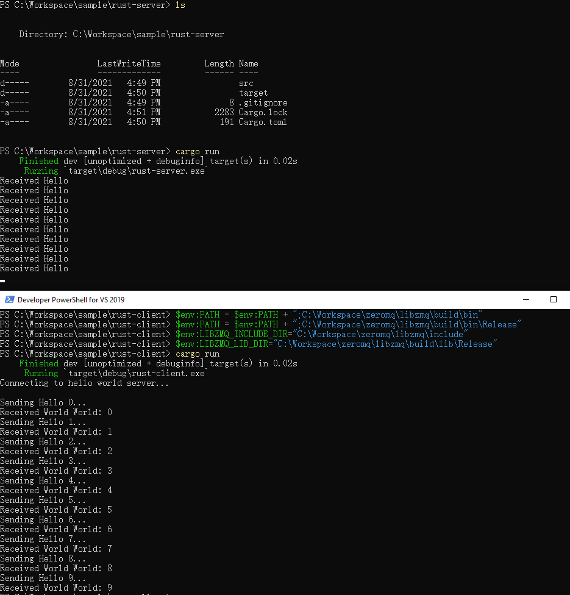

# 1 Prerequisite

You need a Windows environment (I am using Windows 10 LTSC but other versions should work as expected). Please install the Visual Studio 2019 Community Edition.

**IMPORTANT**

All the command prompt we use is *Developer Powershell for VS2019*. You can find the shortcut under: *Start Menu* -> *Visual Studio 2019* -> *Developer Powershell for VS2019*. Because it will setup all environment variables for compilers and linkers.

# 2 Build Libzmq

Please clone the zeromq library source code from: https://github.com/zeromq/libzmq. We will use `$LIBZMQ_PROJECT$` as the root folder of the *libzmq*.

## 2.1 Create MSBuild Project

Now let's build the project. Since I am using rust x64, we should also build the library targeting x64 platform. We will firstly use `cmake` to create a msbuild project targeting the x64 platform.

Since `cmake` cannot create output in the source folder so let's create a folder under `$LIBZMQ_PROJECT$` first:

```
PS> mkdir build
PS> cd build
```

Run the following command under `./build` folder to create the msbuild project:

```
PS> cmake -D CMAKE_CXX_FLAGS_RELEASE="/MT" -D CMAKE_CXX_FLAGS_DEBUG="/MTd" WITH_DOC=OFF -D WITH_PERF_TOOL=OFF -D ZMQ_BUILD_TESTS=OFF -D ENABLE_CPACK=OFF  ../
```

The generated MSBuild project will by default target against x64 platform. For example you can examine `libzmq.vcxproj`:

```xml
...
<ItemGroup Label="ProjectConfigurations">
    <ProjectConfiguration Include="Debug|x64">
        <Configuration>Debug</Configuration>
        <Platform>x64</Platform>
    </ProjectConfiguration>
    <ProjectConfiguration Include="Release|x64">
        <Configuration>Release</Configuration>
        <Platform>x64</Platform>
    </ProjectConfiguration>
    <ProjectConfiguration Include="MinSizeRel|x64">
        <Configuration>MinSizeRel</Configuration>
        <Platform>x64</Platform>
    </ProjectConfiguration>
    <ProjectConfiguration Include="RelWithDebInfo|x64">
        <Configuration>RelWithDebInfo</Configuration>
        <Platform>x64</Platform>
    </ProjectConfiguration>
</ItemGroup>
...
```

## 2.2 Build Libzmq

Now run the msbuild under the `./build` folder to create the dynamic liked library:

```
PS> msbuild /v:minimal /p:Configuration=Release libzmq.vcxproj
```

After build succeeds. You should be able to find the following folder:

* `$LIBZMQ_PROJECT$/build/bin/Release`: The dll file locates here.
* `$LIBZMQ_PROJECT$/build/lib/Release`: The lib file locates here (needed by the linker).

> Note that if you are using *Debug* configuration, the folder will be suffixed with `/Debug`

We also need the header file when we build the RUST sample.

* `$LIBZMQ_PROJECT$/include`

## 2.3 Rename the Linker Library

Please go to the `$LIBZMQ_PROJECT$/build/lib` folder. You may find the library file is named like this: `libzmq-v142-mt-4_3_5.lib`. Please rename it to `zmq.lib`.

# 3 Build Rust Project

Now we can build our rust project. Please go to the ZeroMQ rust example. For example `rust-client`.

Before running the build process, we need to set the environment variable so that *Rust-zmq* can find all the required files:

```
PS> $env:LIBZMQ_LIB_DIR="$LIBZMQ_PROJECT$/build/lib/Release"
PS> $env:LIBZMQ_INCLUDE_DIR="$LIBZMQ_PROJECT$/include"
```

If you want to know why, please refer to: https://github.com/erickt/rust-zmq/blob/master/zmq-sys/build/pkg_config.rs

We also need to set the location of the dynamic linked library to the `PATH` variable so that RUST application can find the dll.

```
PS> $env:PATH=$env:PATH + ";$LIBZMQ_PROJECT$/build/bin/Release"
```

Now we can correctly build & run the sample project:

```
PS> cargo clean
PS> cargo build
PS> cargo run
```


